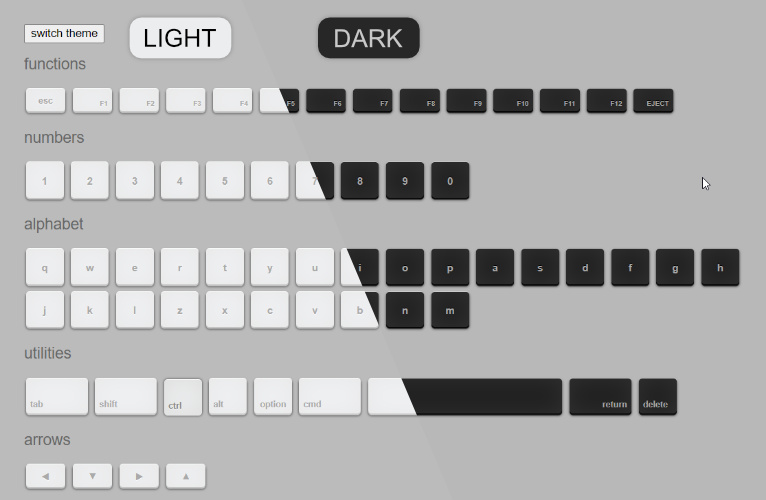

# Keyboard keys - css styles (light/dark theme)

Keyboard keys provides a suite of css classes that render realistic keyboard keys, both light and dark theme.

## preview - [Demo Page](https://monsterbrain.github.io/keyboard-keys/)


## usage
```
<icon class="keyboard-key tab"></icon>
```
